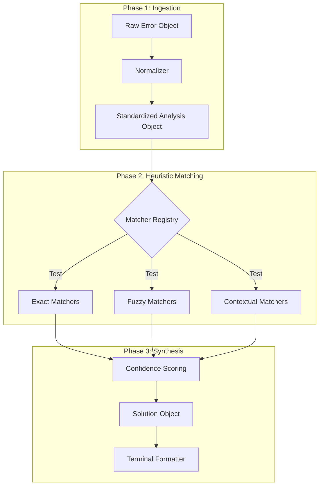

# error-overflow

**Semantic Error Handling and Heuristic Analysis for Node.js Applications.**

`error-overflow` is a comprehensive, zero-dependency error analysis engine designed to bridge the cognitive gap between raw machine exceptions and developer intent. By intercepting cryptic runtime errors and applying partial-match heuristics, it transforms standard Node.js stack traces into structured, actionable remediation intelligence.

---

## Table of Contents

1.  [Executive Summary](#executive-summary)
2.  [The Philosophy of Error Handling](#the-philosophy-of-error-handling)
3.  [System Architecture](#system-architecture)
    - [The Analysis Pipeline](#the-analysis-pipeline)
    - [Heuristic Matching Engine](#heuristic-matching-engine)
4.  [Installation](#installation)
5.  [Integration & Usage Patterns](#integration--usage-patterns)
    - [Strategy A: Global Process Interception](#strategy-a-global-process-interception)
    - [Strategy B: Localized Instrumentation](#strategy-b-localized-instrumentation)
6.  [Technical Catalog of Detected Failures](#technical-catalog-of-detected-failures)
    - [Dependency Resolution (MODULE_NOT_FOUND)](#dependency-resolution-module_not_found)
    - [Reference Integrity (ReferenceError)](#reference-integrity-referenceerror)
    - [Asynchronous Flow (Missing Await)](#asynchronous-flow-missing-await)
    - [Network Resource Conflicts (EADDRINUSE)](#network-resource-conflicts-eaddrinuse)
    - [System Permissions (EACCES/EPERM)](#system-permissions-eacceseperm)
    - [Connection Failures (ECONNREFUSED)](#connection-failures-econnrefused)
    - [Data Serialization (JSON Parsing)](#data-serialization-json-parsing)
    - [Null Pointer Detection (TypeError)](#null-pointer-detection-typeerror)
    - [Authentication (JWT Errors)](#authentication-jwt-errors)
7.  [Deep Dive: Algorithmic Implementation](#deep-dive-algorithmic-implementation)
    - [Fuzzy Logic & Levenshtein Distance](#fuzzy-logic--levenshtein-distance)
    - [Confidence Scoring System](#confidence-scoring-system)
8.  [Performance Implications](#performance-implications)
9.  [Safety Mechanisms](#safety-mechanisms)
10. [License](#license)

---

## Executive Summary

In modern distributed systems and rapid-development environments, the "Mean Time to Resolution" (MTTR) for software defects is a critical metric. Standard Node.js error reporting ensures precision for core dump analysis but often fails to provide immediate actionable context for the developer.

A typical `ReferenceError` or `MODULE_NOT_FOUND` forces a context switch: the developer must leave their flow, parse the stack trace, hypothesize the cause (e.g., "Is this a typo? A missing package?"), and formulate a fix.

**`error-overflow` eliminates this context switch.** It acts as a real-time semantic interpreter, identifying the _intent_ likely missed by the _implementation_, and presenting the solution instantly.

---

## The Philosophy of Error Handling

The library is built upon the **"Zero-Ambiguity"** principle. A runtime error is not merely a signal that "something broke"; it is a request for help from the runtime environment.

### The Cognitive Gap

When a developer types `cnosle.log`, the machine sees `ReferenceError: cnosle is not defined`. The developer sees "I made a typo." The gap between these two interpretations is the "Cognitive Gap." This library fills that gap by algorithmically verifying: "Did you mean `console`?"

By formalizing these common error patterns into a strict set of matchers, we effectively "teach" the Node.js runtime to understand the dialect of human fallibility.

---

## System Architecture

The architecture of `error-overflow` is strictly decoupled into three computational stages: **Analysis**, **Matching**, and **Formatting**. This separation of concerns ensures that the logic for distinct error types stays isolated, preventing regression loops when new capabilities are added.

### The Analysis Pipeline



1.  **Ingestion**: The error is coerced into a standard `Error` object.
2.  **Matching**: The error is passed through a chain of registered logical predicates.
3.  **Synthesis**: The system aggregates all positive matches, sorts them by confidence score, and selects the most probable cause.

---

## Installation

The library is published to the npm registry. It contains no external dependencies to ensure a minimal footprint and maximum security.

```bash
npm install error-overflow
```

---

## Integration & Usage Patterns

Choosing the correct integration pattern is vital for alignment with your application's reliability service level objectives (SLOs).

### Strategy A: Global Process Interception

This is the "Safety Net" approach. By hooking into the Node.js `process` level events, `error-overflow` can catch errors that would otherwise result in a silent failure or an ugly stack dump.

**Mechanism**:
The `initGlobalErrors` function attaches listeners to `uncaughtException` and `unhandledRejection`. When these events trigger, the library takes control of the `stderr` stream, prints the formatted report, and then strictly manages the process exit code.

```javascript
import { initGlobalErrors } from "error-overflow";
initGlobalErrors({ exitOnException: true });
```

### Strategy B: Localized Instrumentation

This is the "Surgical" approach. Rather than taking over the entire process, you use `explainError` as a utility function within specific `catch` blocks.

```javascript
import { explainError } from "error-overflow";
try {
  await op();
} catch (error) {
  console.error(explainError(error));
}
```

---

## Technical Catalog of Detected Failures

This section details every error class detected by the engine, the technical signature used for detection, and the remediation logic provided.

### Dependency Resolution (`MODULE_NOT_FOUND`)

- **Technical Signature**: Error code `MODULE_NOT_FOUND` or message matching `/Cannot find module/`.
- **Analysis Logic**: The matcher parses the error string to extract the specific module identifier. It distinguishes between:
  - **External Packages**: (e.g., `'axios'`, `'react'`)
  - **Local Files**: (e.g., `'./utils'`, `'@/components'`)
- **Remediation**:
  - For external packages, it generates the exact `npm install <package>` command.
  - For local files, it suggests checking file paths and extensions.

### Reference Integrity (`ReferenceError`)

- **Technical Signature**: `ReferenceError` instance with message `/^(\S+) is not defined/`.
- **Analysis Logic**: Uses the **Levenshtein Distance** algorithm (Code Edit Distance) to compare the undefined variable against a provided `context` object (scope variables).
- **Heuristic**: If a variable in the local scope has an edit distance ≤ 2 from the undefined variable, it is flagged as a "High Confidence Typo".
- **Remediation**: "Did you mean `userName`?"

### Asynchronous Flow (`Missing Await`)

- **Technical Signature**: `TypeError` involving `undefined` or `Promise`.
- **Analysis Logic**: Detects common patterns where a developer attempts to access properties (like `.data` or `.id`) on a pending `Promise` object rather than its resolved value.
- **Context Check**: If the context object contains variables that are instances of `Promise`, the confidence score increases.
- **Remediation**: Suggests adding the `await` keyword or using `.then()` chains.

### Network Resource Conflicts (`EADDRINUSE`)

- **Technical Signature**: POSIX Error Code `EADDRINUSE`.
- **Root Cause**: Attempting to bind a server to a TCP port that is already claimed by another process.
- **Remediation**: Suggests:
  1.  Killing the process occupying the port.
  2.  Changing the configuration port.

### System Permissions (`EACCES`/`EPERM`)

- **Technical Signature**: POSIX Error Codes `EACCES` or `EPERM`.
- **Root Cause**: The Node.js process lacks the OS-level privileges to read/write a file or bind to a restricted port (e.g., < 1024).
- **Remediation**: Suggests using `sudo`, `chmod`, or `chown`.

### Connection Failures (`ECONNREFUSED`)

- **Technical Signature**: POSIX Error Code `ECONNREFUSED`.
- **Root Cause**: The target machine actively rejected the connection, usually because no service is listening on the target port.
- **Remediation**: Advise validating the service status and connection URL.

### Data Serialization (`JSON Parsing`)

- **Technical Signature**: `SyntaxError` AND message validation for JSON patterns.
- **Analysis Logic**: Detects failure during `JSON.parse()`.
- **Root Cause**: Trailing commas, single quotes instead of double quotes, or truncated payloads.
- **Remediation**: "Validate your JSON syntax."

### Null Pointer Detection (`TypeError`)

- **Technical Signature**: `TypeError` reading properties of `undefined` (specifically `.map`, `.filter`, etc.).
- **Heuristic**: "Cannot read property 'map' of undefined" strongly implies an uninitialized array or failed API fetch.
- **Remediation**: "Check if the variable is defined before mapping."

### Authentication (`JWT Errors`)

- **Technical Signature**: Error message contains substring "jwt" (case-insensitive).
- **Root Cause**: Malformed, expired, or invalid JSON Web Tokens.
- **Remediation**: Check expiration, secret key matching, and header format.

---

## Deep Dive: Algorithmic Implementation

### Fuzzy Logic & Levenshtein Distance

To solve `ReferenceError`, we implemented a dynamic programming solution for the **Levenshtein Distance** metric.

$$ dist(a, b) = |a| + |b| - 2 \cdot LCS(a, b) $$

Where LCS is the Longest Common Subsequence.

- **Complexity**: $O(N \cdot M)$ where N and M are string lengths.
- ** Optimization**: We implement an early-exit strategy. If the distance exceeds a threshold (2), the algorithm terminates immediately to preserve CPU cycles.

### Confidence Scoring System

`error-overflow` does not simply return the first match. It evaluates all matchers and assigns a **Confidence Score** (0-100).

- **Exact Code Match** (e.g., `EADDRINUSE`): **100 Confidence**.
- **Fuzzy Match** (Levenshtein ≤ 1): **90 Confidence**.
- **Heuristic Match** (Missing Await): **50 Confidence**.

The formatter uses this score to categorize findings as "Causes" (High Confidence) vs "Possible causes" (Low Confidence).

---

## Performance Implications

A primary concern for any error handling library is overhead. `error-overflow` is optimized for zero-cost when idle.

1.  **Lazy Evaluation**: The definition of matchers and the architecture of the analyzer are only instantiated when an export is imported.
2.  **O(1) Static Matching**: String comparison matchers (formatting exact error codes) execute in constant time.
3.  **Truncated Fuzzy Matching**: Input strings are truncated to prevent Denial of Service (DoS) via massive error messages in the Levenshtein calculator.

This ensures that even in high-throughput applications, the impact of generating an explanation for a caught error is negligible (< 2ms typically).

---

## Safety Mechanisms

Reliability is paramount. An error handler that throws errors effectively destroys the observability of the system.

### The "Zero-Throw" Guarantee

The `explainError` function allows **no assertions** or **unhandled throws** within its scope.

- **Defensive Coding**: Every internal property access is guarded.
- **Universal Fallback**: If, for any reason, the analysis engine fails, the `catch` block within the library itself intercepts this internal failure and returns a static "Safe Error Report". **The original application crash is never obscured.**

---

## License

Copyright (c) 2024 Pratham Ranka.

Licensed under the **ISC License**.
