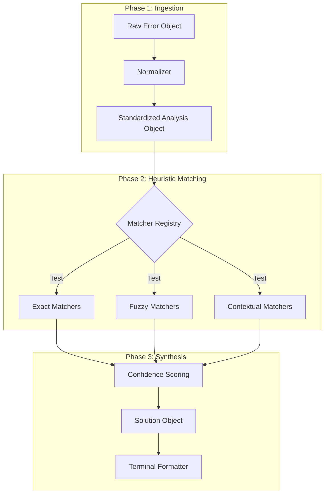

# error-overflow

**Semantic Error Handling and Heuristic Analysis for Node.js Applications.**

`error-overflow` is a comprehensive, zero-dependency error analysis engine designed to bridge the cognitive gap between raw machine exceptions and developer intent. By intercepting cryptic runtime errors and applying partial-match heuristics, it transforms standard Node.js stack traces into structured, actionable remediation intelligence.

---

## Table of Contents

1.  [Executive Summary](#executive-summary)
2.  [The Philosophy of Error Handling](#the-philosophy-of-error-handling)
3.  [System Architecture](#system-architecture)
    *   [The Analysis Pipeline](#the-analysis-pipeline)
    *   [Heuristic Matching Engine](#heuristic-matching-engine)
4.  [Installation](#installation)
5.  [Integration & Usage Patterns](#integration--usage-patterns)
    *   [Strategy A: Global Process Interception](#strategy-a-global-process-interception)
    *   [Strategy B: Localized Instrumentation](#strategy-b-localized-instrumentation)
6.  [Deep Dive: Heuristic Capabilities](#deep-dive-heuristic-capabilities)
    *   [Dependency Resolution Algorithms](#dependency-resolution-algorithms)
    *   [Fuzzy Logic & Levenshtein Distance](#fuzzy-logic--levenshtein-distance)
    *   [Asynchronous Flow Analysis](#asynchronous-flow-analysis)
    *   [System Resource Mapping](#system-resource-mapping)
7.  [Performance Implications](#performance-implications)
8.  [Safety Mechanisms](#safety-mechanisms)
9.  [Frequently Asked Questions](#frequently-asked-questions)
10. [License](#license)

---

## Executive Summary

In modern distributed systems and rapid-development environments, the "Mean Time to Resolution" (MTTR) for software defects is a critical metric. Standard Node.js error reporting ensures precision for core dump analysis but often fails to provide immediate actionable context for the developer.

A typical `ReferenceError` or `MODULE_NOT_FOUND` forces a context switch: the developer must leave their flow, parse the stack trace, hypothesize the cause (e.g., "Is this a typo? A missing package?"), and formulate a fix.

**`error-overflow` eliminates this context switch.** It acts as a real-time semantic interpreter, identifying the *intent* likely missed by the *implementation*, and presenting the solution instantly.

---

## The Philosophy of Error Handling

The library is built upon the **"Zero-Ambiguity"** principle. A runtime error is not merely a signal that "something broke"; it is a request for help from the runtime environment.

### The Cognitive Gap
When a developer types `cnosle.log`, the machine sees `ReferenceError: cnosle is not defined`. The developer sees "I made a typo." The gap between these two interpretations is the "Cognitive Gap." This library fills that gap by algorithmically verifying: "Did you mean `console`?"

By formalizing these common error patterns into a strict set of matchers, we effectively "teach" the Node.js runtime to understand the dialect of human fallibility.

---

## System Architecture

The architecture of `error-overflow` is strictly decoupled into three computational stages: **Analysis**, **Matching**, and **Formatting**. This separation of concerns ensures that the logic for distinct error types stays isolated, preventing regression loops when new capabilities are added.

### The Analysis Pipeline



1.  **Ingestion**: The error is coerced into a standard `Error` object if it isn't one already.
2.  **Matching**: The error is passed through a chain of registered logical predicates.
3.  **Synthesis**: The system aggregates all positive matches, sorts them by confidence score, and selects the most probable cause.

---

## Installation

The library is published to the npm registry. It contains no external dependencies to ensure a minimal footprint and maximum security.

```bash
npm install error-overflow
```

---

## Integration & Usage Patterns

Choosing the correct integration pattern is vital for alignment with your application's reliability service level objectives (SLOs).

### Strategy A: Global Process Interception

This is the "Safety Net" approach. By hooking into the Node.js `process` level events, `error-overflow` can catch errors that would otherwise result in a silent failure or an ugly stack dump.

**Mechanism**:
The `initGlobalErrors` function attaches listeners to `uncaughtException` and `unhandledRejection`. When these events trigger, the library takes control of the `stderr` stream, prints the formatted report, and then strictly manages the process exit code.

**Recommended For**:
*   CLI Tools
*   Build Scripts
*   Development Servers
*   Rapid Prototyping

```javascript
import { initGlobalErrors } from "error-overflow";

// Must be called as early as possible in the bootstrap phase.
initGlobalErrors({
    exitOnException: true 
    // Set to 'false' if you wish to perform your own cleanup logic after reporting.
});
```

### Strategy B: Localized Instrumentation

This is the "Surgical" approach. Rather than taking over the entire process, you use `explainError` as a utility function within specific `catch` blocks. This allows your application to remain resilient and recover from the error.

**Recommended For**:
*   REST API Endpoints (Express/Fastify/NestJS)
*   Background Jobs (BullMQ/Redis)
*   Critical User Flows (Payment Processing)

```javascript
import { explainError } from "error-overflow";

async function processPayment(user, amount) {
    try {
        await gateway.charge(user, amount);
    } catch (error) {
        // We do typically NOT want to crash the server here.
        // Instead, we log the useful explanation to our monitoring service.
        const analysis = explainError(error, { user, amount });
        
        logger.error({
            message: "Payment Failed",
            humanReadable: analysis,
            stack: error.stack
        });
        
        throw new FriendlyError("Payment could not be completed.");
    }
}
```

---

## Deep Dive: Heuristic Capabilities

The power of `error-overflow` lies in its diverse set of matchers. Each matcher is a specialized algorithm designed to detect a specific class of failure.

### Dependency Resolution Algorithms
**Target Error**: `MODULE_NOT_FOUND`

The matcher parses the raw error message to extract the import path. It distinguishes between local file paths (starting with `./` or `/`) and npm package names.
*   **Action**: If it identifies a missing npm package, it generates the exact `npm install` command required.
*   **Logic**: It ensures that core Node.js modules (like `fs` or `path`) are not flagged as missing npm packages.

### Fuzzy Logic & Levenshtein Distance
**Target Error**: `ReferenceError`

When a variable is accessed but not defined, the library suspects a typo. It employs the **Levenshtein Distance** algorithm (Code Edit Distance) to compare the undefined variable name against a provided `context` object (list of known variables).
*   **Threshold**: Only matches with a similarity score > 0.8 are presented to avoid false positives.
*   **Context Awareness**: If you pass the current scope's variable names to `explainError`, the accuracy of this matcher increases significantly.

### Asynchronous Flow Analysis
**Target Error**: `TypeError` (e.g., `Cannot read property 'then' of undefined` or `undefined is not a function`)

In modern JavaScript, a common mistake is forgetting the `await` keyword. This results in the code trying to treat a pending `Promise` object as if it were the resolved data value.
*   **Heuristic**: The semantic analyzer looks for property access patterns that typically occur when a Promise is treated as an Object.
*   **Remediation**: It specifically suggests checking antecedent async calls for missing `await` keywords.

### System Resource Mapping
**Target Error**: POSIX System Codes (`EADDRINUSE`, `EACCES`, `ECONNREFUSED`)

Node.js returns low-level operating system error codes for structural failures. These are opaque to many developers.
*   **EADDRINUSE**: Detected when starting a server. The library suggests the specific `lsof` or `kill` command to free the port.
*   **EACCES**: Detected during file operations. It identifies permission boundaries and suggests ownership (`chown`) or mode (`chmod`) changes.

---

## Performance Implications

A primary concern for any error handling library is overhead. `error-overflow` is optimized for zero-cost when idle.

1.  **Lazy Evaluation**: The definition of matchers and the architecture of the analyzer are only instantiated when an export is imported.
2.  **O(1) Static Matching**: String comparison matchers (formatting exact error codes) execute in constant time.
3.  **O(N*M) Fuzzy Matching**: The Levenshtein calculation is the most expensive operation. To mitigate this:
    *   It is **only** triggered for `ReferenceError` types.
    *   Input strings are truncated to prevent Denial of Service (DoS) via massive error messages.
    *   The loop exits early if the distance exceeds the threshold.

This ensures that even in high-throughput applications, the impact of generating an explanation for a caught error is negligible (< 2ms typically).

---

## Safety Mechanisms

Reliability is paramount. An error handler that throws errors effectively destroys the observability of the system.

### The "Zero-Throw" Guarantee
The `explainError` function allows **no assertions** or **unhandled throws** within its scope.
*   **Defensive Coding**: Every internal property access is guarded.
*   **Universal Fallback**: If, for any reason, the analysis engine fails (e.g., a cyclic object is passed as context), the `catch` block within the library itself intercepts this internal failure and returns a static "Safe Error Report". **The original application crash is never obscured.**

---

## Frequently Asked Questions

**Q: Can I use this in the browser?**
A: Currently, this library is optimized for the **Node.js runtime** environment (access to `process`, file system codes, etc.). Browser support is on the roadmap but not currently active.

**Q: Will this hide the stack trace from my logs?**
A: **No.** When using `initGlobalErrors`, it suppresses the stack trace from *standard output* to the terminal to keep the developer experience clean. However, it does **not** interfere with other loggers (like Winston, Pino, or Datadog agents) that might be attached to the process. You maintain full observability while gaining better localized feedback.

**Q: Does it support TypeScript?**
A: Yes. The library ships with native type definitions, ensuring full Intellisense support in your IDE.

---

## License

Copyright (c) 2024 Pratham Ranka.

Licensed under the **ISC License**.
