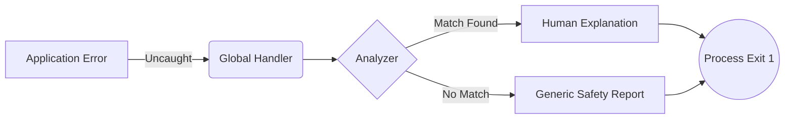

# error-overflow

**Errors for Humans, not Robots.**

A lightweight, zero-dependency library that instantly translates cryptic Node.js errors into simple, actionable explanations with specific "Try this" fixes.

## Table of Contents

- [Introduction](#introduction)
- [Why Use This?](#why-use-this)
- [Installation](#installation)
- [Usage](#usage)
- [Architecture & Best Practices](#architecture--best-practices)
- [Features](#features)
- [Safety & Stability](#safety--stability)
- [License](#license)

---

## Introduction

Node.js errors are often technical and focused on the stack trace rather than the solution. `error-overflow` intercepts these raw errors—such as `MODULE_NOT_FOUND`, `EADDRINUSE`, or confusing `undefined` property access—and converts them into a structured report.

It does not hide the original error; it augments it with context, probable causes, and suggested fixes.

## Why Use This?

Standard Error Output:

```text
Error: MODULE_NOT_FOUND
Error: Cannot find module 'axios'
```

With error-overflow:

```text
Missing Module

What happened
Node.js could not find 'axios'.

Likely causes
- The package is not installed
- The path to the file is incorrect

Try this
- Run 'npm install axios'
- Check your package.json dependencies
```

## Installation

Install the package via npm:

```bash
npm install error-overflow
```

## Usage

The library exports two main functions: `explainError` for manual handling and `initGlobalErrors` for automatic handling.

### Global Setup (Recommended)

Catch all unhandled errors automatically at the start of your application.

```javascript
import { initGlobalErrors } from "error-overflow";

// Call this once at the top of your entry file
initGlobalErrors();

// Now any unhandled error will be explained automatically!
throw new Error("Something went wrong");
```

### Manual Usage

Use `explainError(error, context)` to handle specific errors.

### Basic Example

Wrap your error logging logic with `explainError`.

```javascript
import { explainError } from "error-overflow";

try {
  await doSomethingRisky();
} catch (err) {
  // Pass the error object to get a formatted string
  console.log(explainError(err));
}
```

### Advanced Example (Context)

You can pass a context object as the second argument. This allows the library to provide smarter suggestions, such as fuzzy matching for variable names.

```javascript
const user = { name: "Alice" };

try {
  // Typo: 'usr' is not defined
  console.log(usr.name);
} catch (err) {
  // Pass available variables to help the matching algorithm
  console.log(explainError(err, { user }));
}
```

## Architecture & Best Practices

Choose the right integration strategy for your application's needs.

### 1. Global Handler (`initGlobalErrors`)

**Use Case:** 🛑 **CRASH & REPORT**

Designed for catching unexpected, unrecoverable errors. It intercepts the crash, prints a human-readable report, and then cleanly exits the process.

> **Goal:** Transform a cryptic stack trace into a helpful crash report.



### 2. Manual Handler (`explainError`)

**Use Case:** 🛡️ **RECOVER & CONTINUE**

Designed for expected errors where the application should stay alive (e.g., API failures, user input validation).

> **Goal:** Gracefully handle errors without downtime.

```javascript
try {
  await database.connect();
} catch (err) {
  console.error(explainError(err)); // Log and keep running
  retryConnection();
}
```

| Feature      | Global Handler (`initGlobalErrors`) | Manual Handler (`explainError`)    |
| :----------- | :---------------------------------- | :--------------------------------- |
| **Trigger**  | Uncaught Exception / Rejection      | `catch (err)` block                |
| **Outcome**  | Logs explanation & **Exits App**    | Returns string & **Continues App** |
| **Best For** | Final safety net, CLI tools         | Critical services, UI feedback     |
| **Context**  | Limited (Global Scope)              | Rich (Local Scope variables)       |

## Features

- **Missing Dependencies**: Identifies missing packages and suggests installation commands.
- **Typos**: Detects ReferenceErrors and suggests the correct variable name using fuzzy matching.
- **Missing Await**: Detects attempts to access properties of a Promise that was not awaited.
- **Multi-Cause Analysis**: Aggregates insights from multiple matching patterns when an error is ambiguous.
- **JSON Errors**: Provides detailed explanations for parsing failures, such as trailing commas or missing quotes.
- **System Errors**: Handles common system codes like `EADDRINUSE` (Port in use) and `EACCES` (Permission denied).

## Safety & Stability

This library is designed to be crash-proof in production environments.

1.  **Zero Throw Guarantee**: The `explainError` function will never throw an exception.
2.  **Fallback Mechanism**: If an error cannot be matched to a known pattern, it falls back to a generic, safe explanation.
3.  **Input Validation**: All inputs are validated to ensure the error handler does not introduce new bugs.

## License

ISC
